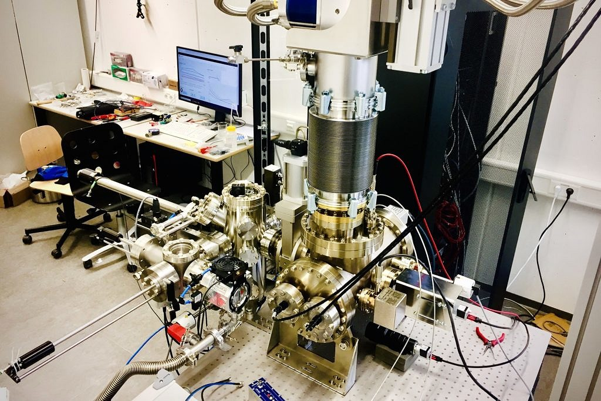
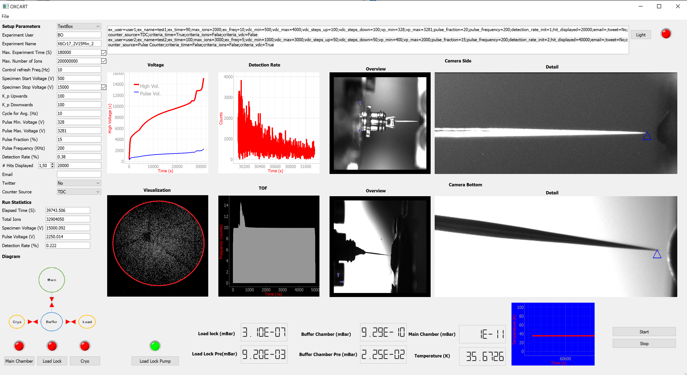

#  PyOXCART - An open source package in Python for OXCART Atom Prob 

 OXCART is an in-house atom probe. 
The unique feature of this device is that it has a measuring chamber made of titanium to generate a particularly low-hydrogen vacuum.
The Oxcart was equipped with a highly efficient detector (approx. 80% detection efficiency). PyOXCART is an atom probe control software that saves the data in FAIR data format.

In the first step, we provide a GUI to control the Oxcart atom probe. This system takes the detection events out of a commercially available delayline detector (Surface Concept DLD 8080) via a USB 3.0 connection from the time-to-digital converter. The data is then stored in a FAIR (findable, accessible, interoperable, and reusable) data format (HDF5), which contains all data collected during the experiment, including detector raw data. 
Therefore, this control system provides the basis of a fully FAIR atom probe data collection and analysis chain.  
This repository contains the GUI and program, which control, visualize, and do the atom probe experiment.
The image below is an overview of the user interface:

#  Installation
1- create the virtual environment via Anaconda:
    
    conda create -n myenv python=3.10

2- Activate the virtual environment:

    conda activate myenv
    

3- Install dependencies:
    
    pip install -r requirements.txt
# Running an experiment
TODO
# Citing 
TODO

