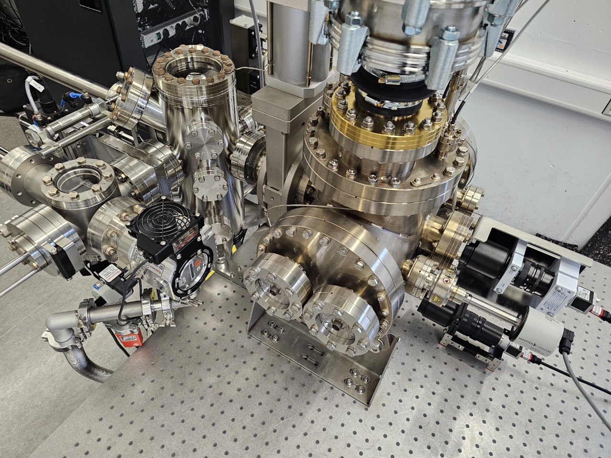

# PyCCAPT (APT_PyControl)

# A modular, FAIR open-source python atom probe tomography software package for experiment control and data calibration

<!--
-->

This package aims to provide an open-source software for controlind atom probe systems and calibrate
the data. The package is modular and can be used in a wide range of applications.

----------

# Presentation

Atom probe instruments are predominantly commercial systems with proprietary software.
This limits the accessibility and customization of experiments requiring low-level control and data analysis.
PyCCAPT addresses this limitation by providing an open-source software package that can control atom probe systems and
perform data calibration.

PyCCAPT was initially developed and tested on the OXCART atom probe, an in-house atom probe system. The OXCART atom
probe features a measuring chamber made of titanium, which enables a particularly low-hydrogen vacuum. It is equipped
with a highly efficient detector (~80% detection efficiency). The PyCCAPT package can also be used to control other atom
probe systems.

The package is modular and adaptable to a wide range of instrument, such as Pfeifer gauges, Fug power supply and Siglent
signal generator. So far it is capable of collecting data from Surface consept and ReoenDek TDC systems.

The PyCCAPT package forms the foundation of a fully FAIR atom probe data collection and processing chain. This
repository includes the graphical user interface (GUI) and control program, which enable experiment control,
visualization, and data acquisition. The following images provide an overview of the user interface:

 ---------------------

# Installation

1- create the virtual environment via Anaconda:

    conda create -n apt_env python=3.9

2- Activate the virtual environment:

    conda activate apt_env

3- Install the package:

Clone or download this repository and unzip it. In the project directory, run the following command:

    pip install -e .

--------------
# Documentation

The latest versions of the documentation can be accessed on our
[ReadTheDocs](https://pyccapt.readthedocs.io/en/latest/?#) page. It contains descriptions of
Crappy's features, tutorials, and other useful information.

--------------------
## Running PyCCAPT control GUI

After installing the project locally or via pip command enter the following command in the console:

    python pyccapt

--------------------

# Edite GUI 

Edite the GUI with Qt-Designer and run command below to create your own GUI
UI in the GUI module.

    pyuic6 -x gui_simple_layout.ui -o gui_simple_layout.py 

You should then merge the created file with the targeted 

---------------------
# Using PyCCAPT

For control part of the package you can follow the steps on [documentation](https://pyccapt.readthedocs.io/en/latest/configuration.html).

For the calibration you should go through the [tutorial](https://pyccapt.readthedocs.io/en/latest/tutorials.html) first to understand how is it possible 
to use the features of the package.

------------------
# Bug reports

Please report bugs, issues, ask for help or give feedback in the [github section](https://github.com/mmonajem/pyccapt/issues).

Qestions/comments:
  - Mehrpad Monajem, mehrpad.monajem@fau.de

-----------
# Citing 

-----------
# Contributing 

Contributions to PyCCAPT are always welcome, and they are greatly appreciated! Our contribution 
policy can be found [here](https://github.com/mmonajem/pyccapt/blob/main/CONTRIBUTING.md).

