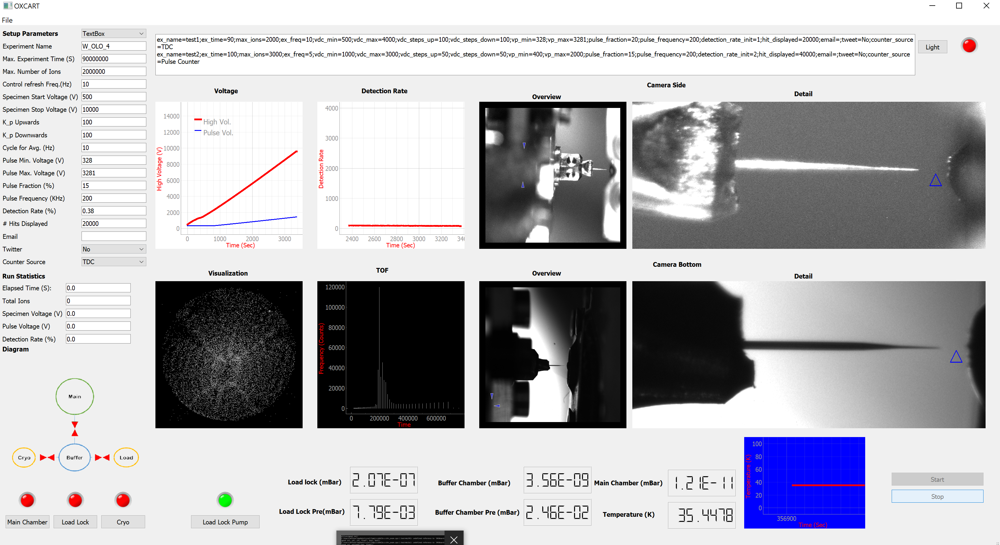

#  An open source package in Python for OXCART Atom Prob 
Oxcart is a self-construction and self-made atom probe. 
The unique feature of this device is that it has a measuring chamber made of titanium to generate a particularly low-hydrogen vacuum.
The Oxcart is equipped with a highly efficient detector (approx. 85% detection efficiency).

In the first release, we provide a GUI to control the Oxcart atom probe. This system takes the detection events out of a commercially available delayline detector (Surface Concept DLD 8080) via a USB 3.0 connection from the time-to-digital converter. The data is then stored in a FAIR (findable, accessible, interoperable, and reusable) data format (HDF5), which contains all data collected during the experiment, including detector raw data. 
This control system therefore provides the basis of a fully FAIR atom probe data collection and analysis chain.  
This repository contains the GUI and program which control, visualize, and do the atom prob experiment.
This is an overview of the user interface:

#  Installation
TODO
# Running an experiment
TODO
# Citing 
TODO

