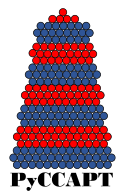
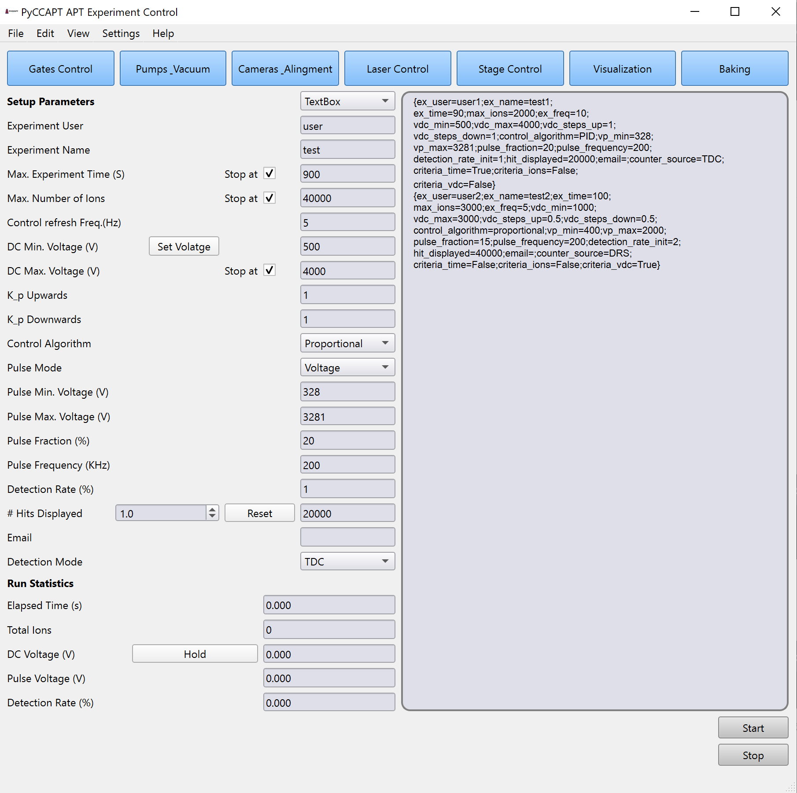

# PyCCAPT (APT_PyControl)
# A modular, FAIR open-source python atom probe tomography software package for experiment control and data calibration 

<!--
-->

/pypi/license/pip
This package aims to provide an open-source software for controlind atom probe systems and calibrate 
the data. The package is modular and can be used in a wide range of applications.

----------

# Presentation

Today, the vast majority of atom probe instruments in use are commercial systems with proprietary software. 
This is limiting for many experiments where low-level access to machine control or experiment result data is necessary.
This package was tested on the OXCART atom probe, which is an in-house atom probe. 
The unique feature of OXCART atom probe is that it has a measuring chamber made of titanium to generate a particularly low-hydrogen vacuum.
It was equipped with a highly efficient detector (approx. 80% detection efficiency). This package is also used to control
other atom probe systems.

PyCCAPT package provides the basis of a fully FAIR atom probe data collection and analysis chain.  
This repository contains the GUI and control program, which control, visualize, and do the atom probe experiment.
The images below are an overview of the two version of user interface:

 ---------------------

#  Installation
1- create the virtual environment via Anaconda:
    
    conda create -n apt_env python=3.9

2- Activate the virtual environment:

    conda activate apt_env

3- Install the package:

    pip install pyccapt

---------------------

# Local installation of PyCCAPT

Clone/download this repository and unzip it. In the project directory enter the following command

    pip install -e .

--------------
# Documentation

The latest versions of the documentation can be accessed on our
[ReadTheDocs](https://pyccapt.readthedocs.io/en/latest/?#) page. It contains descriptions of
Crappy's features, tutorials, and other useful information.

--------------------
## Running PyCCAPT control GUI

After installing the project locally or via pip command enter the following command in the console:

    python pyccapt

--------------------

# Edite GUI 

Edite the GUI with Qt-Designer and run command below to create your own GUI
UI (simple or advance) in the GUI module. 

    pyuic6 -x gui_simple_layout.ui -o gui_simple_layout.py. You should then merge the created file with the targeted 
---------------------
# Using PyCCAPT

For control part of the package you can follow the steps on [documentation](https://pyccapt.readthedocs.io/en/latest/configuration.html).

For the calibration you should go through the [tutorial](https://pyccapt.readthedocs.io/en/latest/tutorials.html) first to understand how is it possible 
to use the features of the package.

------------------
# Bug reports

Please report bugs, issues, ask for help or give feedback in the [github section](https://github.com/mmonajem/pyccapt/issues).

Qestions/comments:
  - Mehrpad Monajem, mehrpad.monajem@fau.de

-----------
# Citing 

-----------
# Contributing 

Contributions to PyCCAPT are always welcome, and they are greatly appreciated! Our contribution 
policy can be found [here](https://github.com/mmonajem/pyccapt/blob/main/CONTRIBUTING.md).

