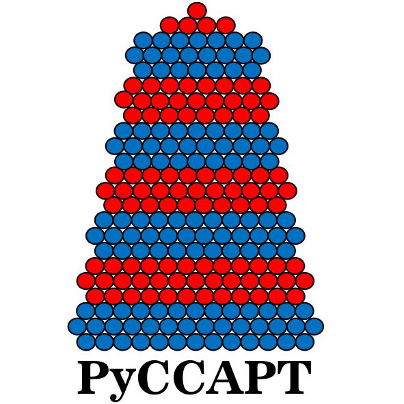

# PyCCAPT Calibration Module

The PyCCAPT Calibration Sub-Module provides essential tools and workflows for calibrating and processing atom probe
tomography (APT) data. This module is designed to assist researchers in preparing and enhancing their APT data for
further analysis.

## Jupyter Workflows

### 1. Data Cropping

- *Description*: Allows you to crop atom probe data, whether it's originally collected using PyCCAPT or in various other
  formats such as EPOS, POS, ATO, and CSV.
- *Usage*: Define the region of interest (ROI) to focus on specific areas of the dataset.

### 2. Time of Flight Calibration

- *Description*: Perform time-of-flight calibration to correct for flight time distortions in the data.
- *Usage*: Improve the accuracy of spatial information in the APT dataset.

### 3. Mass-to-Charge Ratio Calibration

- *Description*: Calibrate the mass-to-charge ratio (MC) of ions in the dataset.
- *Usage*: Enhance the accuracy of quantitative analysis by ensuring precise MC values.

### 4. 3D Reconstruction

- *Description*: Reconstruct atom probe data into a three-dimensional representation.
- *Usage*: Visualize the spatial distribution of atoms within the material.

### 5. Ranging the Mass-to-Charge Ratio

- *Description*: Define a range for the mass-to-charge ratio to filter ions based on specific MC values.
- *Usage*: Focus on ions within a specific MC range for analysis.

### 6. Visualization

- *Description*: Visualize the atom probe data using various plotting and visualization techniques.
- *Usage*: Gain insights into the data through 2D and 3D visualizations.

### 7. T0 and Flight Path Calculation

- *Description*: Calculate T0 (time-of-flight at zero mass-to-charge ratio) and flight paths for ions.
- *Usage*: Essential for precise quantitative analysis and data interpretation.

## Data structures

For the data structure you can check the [data structure](Control_DATA_STRUCTURE.md) file. There is also possibility to
convert
the PyCCAPT HDF5 file data to EPOS, POS, ATO, and CSV file. You can find the
example code in the [tutorial](tutorials/jupyter_files)  section.

## Additional Features

In addition to the core functionalities mentioned above, the calibration module of PyCCAPT offers various advanced
features and capabilities. For detailed information on these features, consult the PyCCAPT documentation.

## Documentation

For comprehensive documentation, including detailed instructions, usage examples, and additional features, please refer
to the official PyCCAPT documentation. You can access the documentation either locally or online.

- Local Documentation (within your PyCCAPT installation)
- Online Documentation (URL to your online documentation)

For specific usage examples and code snippets, explore the Jupyter notebooks provided in
the `tutorials` [directory](tutorials/jupyter_files) of the PyCCAPT package. 

