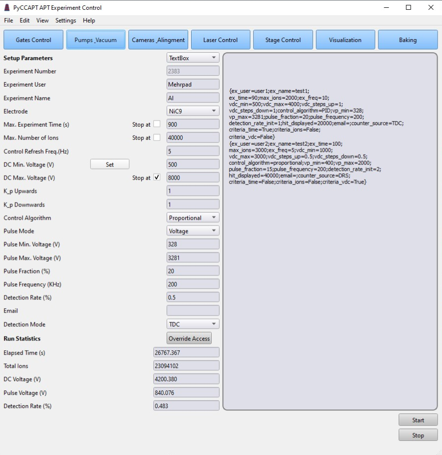
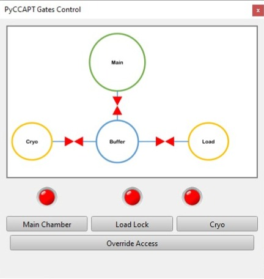
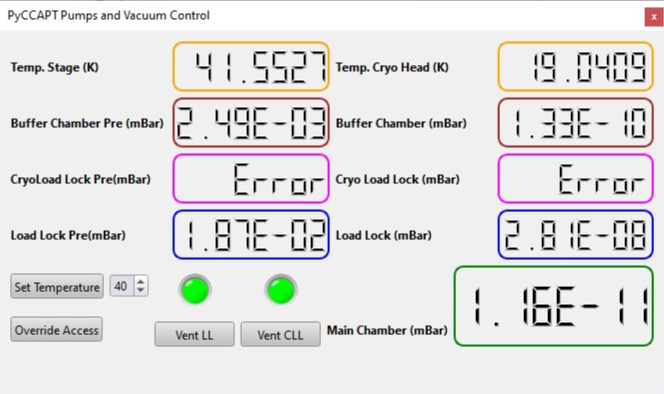
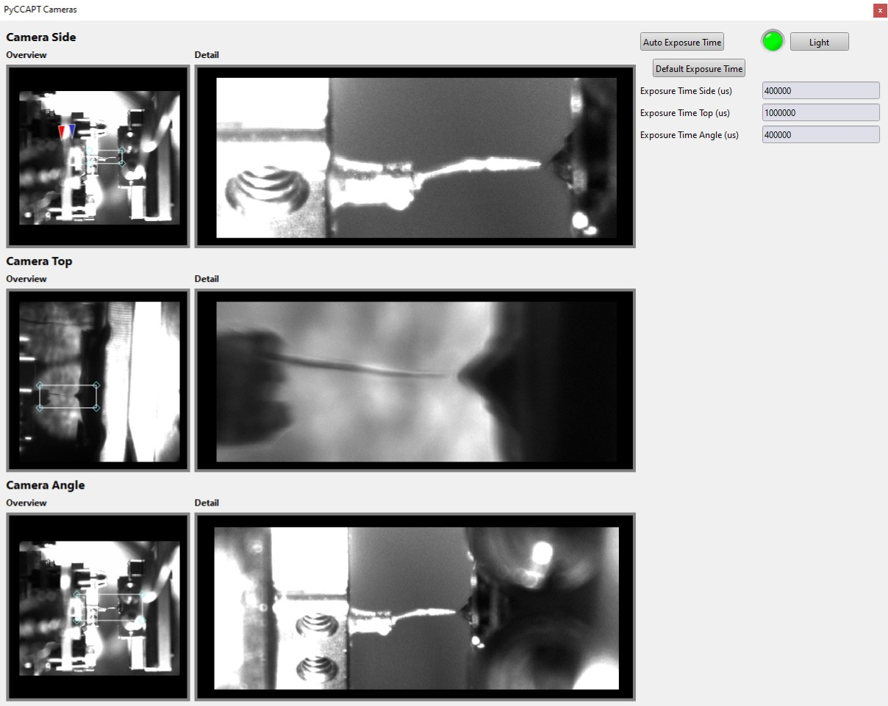
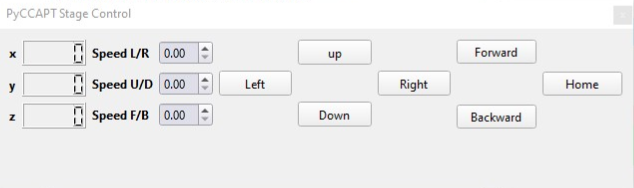
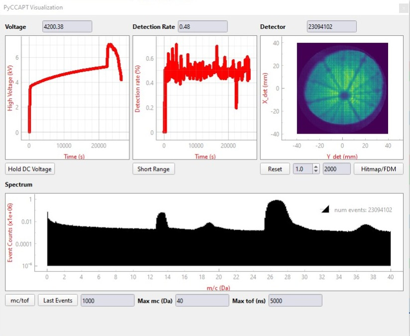
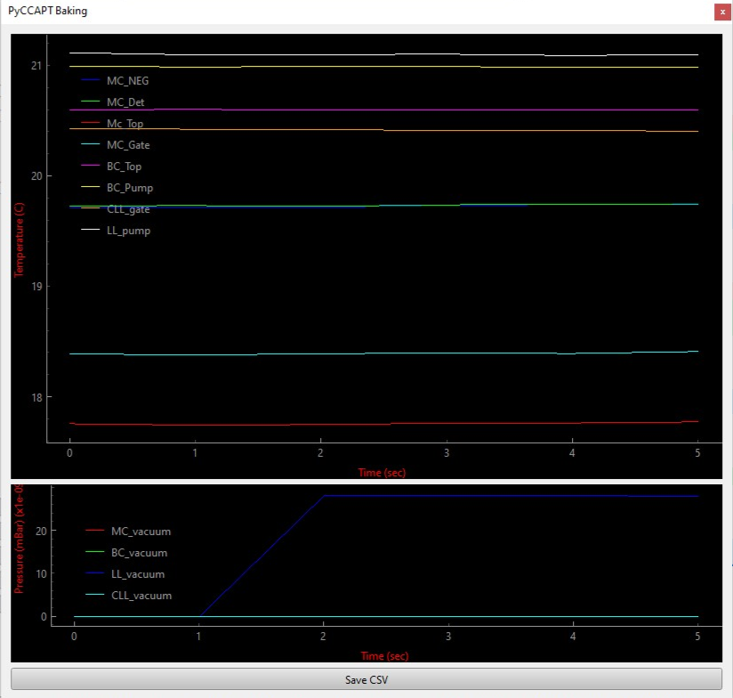

# Control

PyCCAPT is a powerful Python software designed for controlling atom probe tomography instruments, offering researchers
and scientists an efficient means to interact with their equipment. With its capabilities, PyCCAPT is not only
adept at reading surface concepts but also seamlessly interfaces with RoentDek time-to-digital converter (TDC) systems.
This compatibility ensures that PyCCAPT can gather and process critical data from these instruments,
facilitating precise analysis and investigation in the field of atom probe tomography. Whether you're exploring the
nanoscale world of materials or conducting cutting-edge research, PyCCAPT proves to be an invaluable tool for instrument
control and data management, enhancing the capabilities of atom probe tomography systems for a wide range of scientific
applications.

## Overview of the main GUI of the control module

The following images show the GUI of the control module in detail.

## Gates control GUI

## Pumps control, vacuum monitoring, temperature control GUI

## Cameras control GUI

## Laser control GUI

## Stage control GUI

## Visualization GUI

## Baking process GUI

